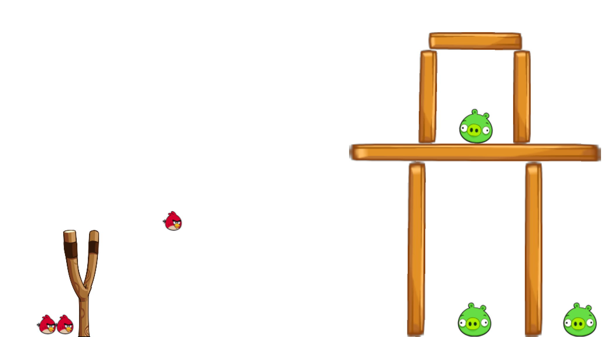

# AngryBirds-Processing

## Introduction

*AngryBirds-Processing* is a reimplementation of the popular game Angry Birds, powered by Processing and Box2D, with the extension of Leap Motion control. It was first created on a Creative Coding lesson, and then became open-source on GitHub, seeking for more contributors. *AngryBirds-Processing* is written with Processing in Java, with a physical engine Box2D to simulate the real world, and can be run on Windows, MacOS and Linux. In addition, *AngryBirds-Processing* supports features of Leap Motion, which means end-users are able to use hands in front of screen to trigger birds and interact with buttons.

***AngryBirds-Processing* is only developed to practice programming and game development, and CANNOT BE USED FOR ANY COMMERCIAL PURPOSES.**



## Install and Run

First make sure that you have installed Processing 3. Click [here](https://processing.org/download/) for downloads.

Then you may also need to have the following dependencies installed, since several extended libraries are used in *AngryBirds-Processing*. Check [here](https://processing.org/reference/libraries/) for more information about adding libraries in Processing 3.

* [Minim](http://code.compartmental.net/minim/)
* [Box2D for Processing](https://github.com/shiffman/Box2D-for-Processing)
* [Leap Motion for Processing](https://github.com/nok/leap-motion-processing)

To install *AngryBirds-Processing*, open a terminate window and input command:

 ```
 git clone https://github.com/peihaowang/AngryBirds-Processing.git
 ```

 After finishing dowloading, you also need to rename the project directory as `AngryBirds` so that you can open the project by double-clicking the file `AngryBirds.pde` subsequently. Within the Processing IDE, simply click the "Run" button to start the game. You might also get interested in playing around the source code, refer to [here](https://processing.org/tutorials/) for more details about Processing.

 *AngryBirds-Processing* is only released with source code.

 ## Acknowledgement

*AngryBirds-Processing* pay tribute to the classical game Angry Birds and is never developed for commercial purposes, only for learning and playing. All originalities and designs are copyright to Rovio Entertainment Ltd. Materials and pictures are all collected from the Internet.

* [Rovio Entertainment Ltd.](http://www.rovio.com)
* [Angry Birds](https://www.angrybirds.com/games/)
* [Processing](https://processing.org)
* [Box2D](http://box2d.org)
* [JBox2D](http://www.jbox2d.org)
* [Box2D for Processing](https://github.com/shiffman/Box2D-for-Processing)
* [Leap Motion](https://www.leapmotion.com)
* [Leap Motion for Processing](https://github.com/nok/leap-motion-processing)

## Contributor

*AngryBirds-Processing* are open for contributing, you are able to design your own birds, pigs, buildings and scenes by deriving the corresponding base classes and override the abstract methods.

* [Peihao Wang](https://github.com/peihaowang)
* [Jayson Haebich](http://jaysonh.com/index.htm)

For more information about developing and extending *AngryBirds-Processing*, please email to me.
